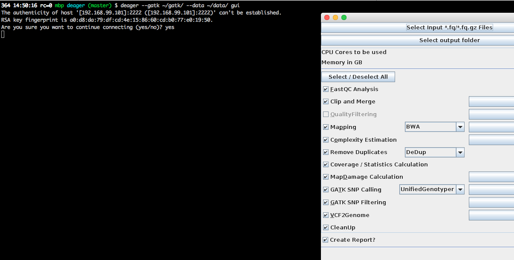

# EAGERpipeline Docker Image

To abstract from the madness of getting the environment set up, the users is supposed to use EAGER via an docker image.

## deager CLI

The EAGER Pipeline comes with a tiny docker binary which helps with the pipeline setup and usage. 
To run the pipeline, you will need to install two things, a running Go environment and Docker.

To install Go, please refer to https://golang.org/dl/ and use the appropriate download and follow your respecitve installation instructions. Afterwards, you should install Docker following the respective instructions here:
http://docs.docker.com/engine/installation/

Afterwards, you could start with the following initial commands to get your environment setup. Note that these might be slightly different on different Unix operating systems, but have been tested on OSX, ArchLinux and Ubuntu 14.04 to work as expected. 


```
$ docker pull apeltzer/eager
$ go get -d github.com/apeltzer/deager
$ go build github.com/apeltzer/deager
$ go install github.com/apeltzer/deager
$ deager -h
Eager Docker Client

Usage:
  deager [options] (start|stop|gui|run)
  deager -h | --help
  deager --version

start:    Spins up the EAGER docker container
stop:     Stop/remove the EAGER container
gui:      Connect to container and start eager GUI
run:      Run eagercli within --data directory

Options:
  --gatk <path>	     Path to the gtak file (jar/tar.bz2) [default: ~/gatk/]
                     It has to be provided by the user, since the license prohibits packaging.
  --data <path>      Directory to use as /data/ directory within eager (default: ~/data)
  --image <str>      Name of the eager image [default: apeltzer/eager]
  --container <str>  Name of the container spun up (default: eager_$USER)
  --uid              Use docker-client UID/GID for eager user within container.
                     This will cope with user rights. (depends on bindmount; boot2docker, local docker deamon...)
  -h --help          Show this screen.
  --version          Show version.
```
### Usage

The tool expects a `data` directory holding the input data / an output directory and a directory holding **one** tar file of the gatk.

```
$ ls -l ~/data/
total 4856144
-rwxr-x---   1 kniepbert  staff  1243169981 Feb 23  2015 3077_01_ACCGAT_L007_R1_001.fastq
-rwxr-x---   1 kniepbert  staff  1243169981 Feb 23  2015 3077_01_ACCGAT_L007_R2_001.fastq
drwxr-x---@ 17 kniepbert  staff         578 Feb 23  2015 Lepra_Ref
drwxr-xr-x  18 kniepbert  staff         612 Nov 14 13:10 output
-rw-r--r--   1 kniepbert  staff           0 Nov 14 14:06 test
$ ls -l ~/gatk/
total 47080
-rw-r--r--@ 1 kniepbert  staff  11476623 Apr 23  2015 GenomeAnalysisTK-3.3-0.tar.bz2
-rw-r--r--  1 kniepbert  staff  12626730 Oct 24  2014 GenomeAnalysisTK.jar
drwxr-xr-x  7 kniepbert  staff       238 Nov 14 12:58 resources
```

To fetch the image and start the docker container just fire up the following command.

```
$ deager --gatk ~/gatk --data ~/data/ start
$ docker ps
NAMES               IMAGE               COMMAND                  PORTS
eager_kniepbert     apeltzer/eager      "supervisord -c /etc/"   0.0.0.0:2222->22/tcp
```

#### gui

Once the container is started, a GUI could be started via ssh.

```
$ deager --gatk ~/gatk/ --data ~/data/ gui
```




## Manually (outdated, to-be updated)

### Create the Image

Just pull the image from the (to be established) docker repository or build it your own from this git repository by fireing up the following command alongside this README.md.

```
docker build --rm -t eager .
```

### Use the pipeline

```
$ docker run -d --privileged --name eager -h eager \
             -v $(pwd)/gatk/:/opt/gatk/ \
             -v /dev/null:/dev/null -v /dev/urandom:/dev/urandom \
             -v /dev/random:/dev/random -v /dev/zero:/dev/zero \
             -p 2232:22 eager:latest
88cae0e1714d37ac27888ffd6a035f1dde1037fbd158f37ff324e97b308b0ddb
```

Since the container spawns an ssh server we might lock in (-X forwards X11).

```
$ ssh 192.168.59.103 -Y -i ssh_eager_rsa.key -l eager -p 2232
/usr/bin/xauth:  file /home/eager/.Xauthority does not exist
[eager@eager ~]$
```

The command ```xeyes``` should open an dumy X11 application to check the X11 forwarding.

The pipeline consists of two components:

- ''eager'': Which executes the graphical user interface, that is required to define and configure the workflow. 
- ''eagercli'': Which executes the created configuration files automatically. 


